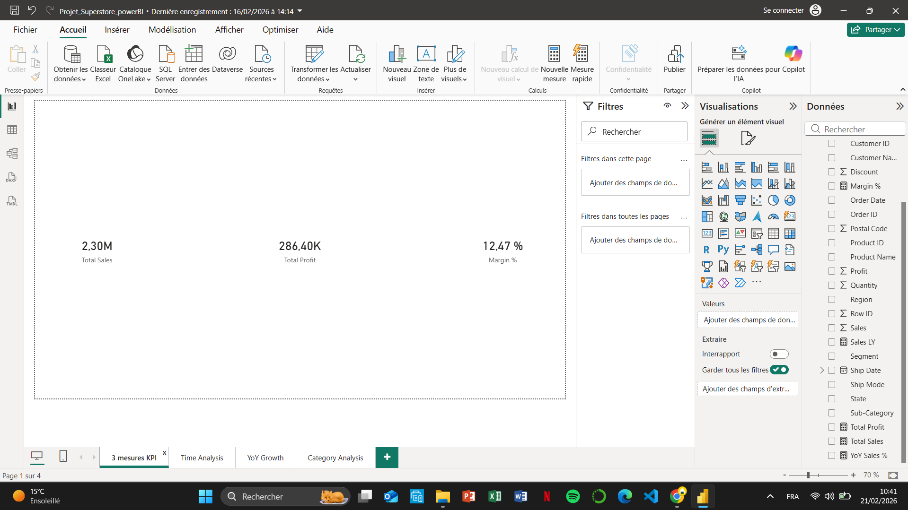
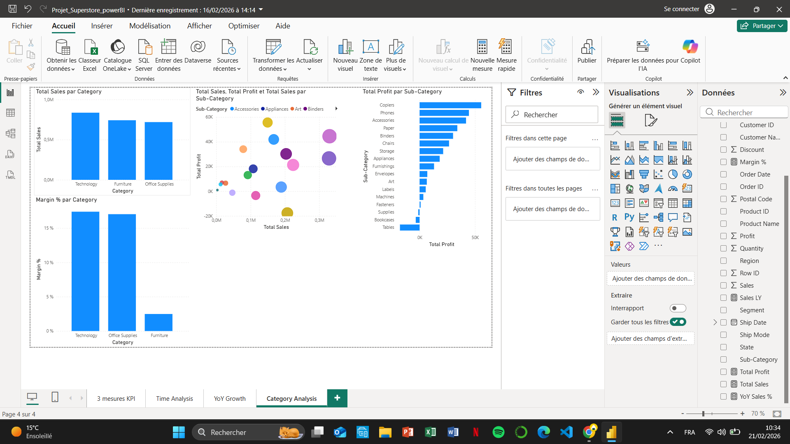
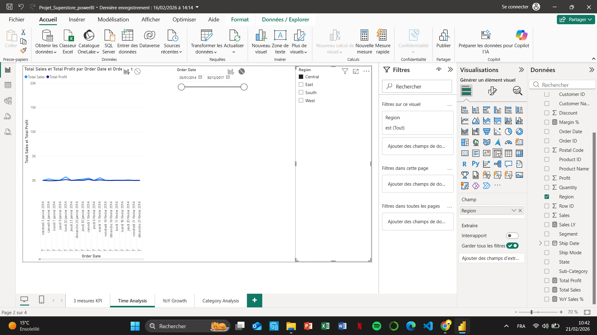

# Retail Sales Analytics (SQL + Power BI) — Superstore

## Overview

End-to-end retail sales analytics portfolio project combining **SQL analysis** and **Power BI dashboarding** using the Superstore dataset.

The project focuses on KPI tracking, category performance analysis, and time-based trend exploration to support data-driven business decisions.

---

## Objectives

* Track core KPIs (Sales, Profit, Margin %)
* Analyze performance by Category & Sub-Category
* Perform time analysis (trends + filters)
* Explore YoY growth patterns

---

## Business Questions

* Which category generates the most revenue?
* Which sub-categories are unprofitable?
* How do sales evolve over time?
* What are the YoY growth trends?

---

## Key Insights

* Technology category drives the highest revenue
* Furniture shows lower margins despite strong sales
* Some sub-categories generate negative profit
* Sales demonstrate steady growth with seasonal variations

---

## Tech Stack

* SQL (data exploration & aggregation)
* Power BI (data modeling & dashboarding)
* DAX (KPI & time intelligence measures)
* Git & GitHub (version control)
* CSV dataset

---

## Methodology

1. Data cleaning & type conversion
2. SQL exploratory analysis
3. KPI definition & calculation
4. Power BI data modeling (star schema + Date table)
5. Dashboard design & storytelling
6. Insight generation

---

## Power BI Dashboard

### KPI Overview

### Category Analysis

### Time Analysis

---

## SQL Scripts

* `sql/02_kpis_global.sql` — Global KPIs
* `sql/03_category_analysis.sql` — Category/Sub-category analysis
* `sql/05_time_analysis.sql` — Time analysis
* `sql/06_yoy_trends.sql` — YoY trends

---

## Repository Structure

* `data/raw/` — dataset
* `sql/` — SQL scripts
* `powerbi/` — PBIX + dashboard screenshots
* `docs/` — documentation (dictionary, KPI definitions)

---

## How to Use

1. Open the `.pbix` file in Power BI Desktop: `powerbi/Projet_Superstore_powerBI.pbix`
2. Ensure dataset path points to: `data/raw/superstore.csv`
3. Refresh data

---

## Notes / Limitations

* YoY measures depend on a proper Date table and clean relationships
* Dataset contains limited historical depth

---

# Data Dictionary – Retail Sales Dataset

## Description

This dataset represents retail sales transactions from a Superstore.
Each row corresponds to a single product sold within a customer order.

## Columns

| Column Name   | Description                                         |
| ------------- | --------------------------------------------------- |
| order_id      | Unique identifier of the order                      |
| order_date    | Date when the order was placed                      |
| ship_date     | Date when the order was shipped                     |
| ship_mode     | Shipping method used                                |
| customer_id   | Unique customer identifier                          |
| customer_name | Customer full name                                  |
| segment       | Customer segment (Consumer, Corporate, Home Office) |
| country       | Country name                                        |
| region        | Region name                                         |
| state         | State name                                          |
| city          | City name                                           |
| product_id    | Unique product identifier                           |
| category      | Product category                                    |
| sub_category  | Product sub-category                                |
| product_name  | Product name                                        |
| sales         | Sales amount (USD)                                  |
| quantity      | Quantity ordered                                    |
| discount      | Discount applied                                    |
| profit        | Profit amount (USD)                                 |

## 📝 Notes

- Monetary values are expressed in **USD**.
- One order can contain multiple products.
- Dates were originally stored as text and converted using `STR_TO_DATE()` for analysis.
